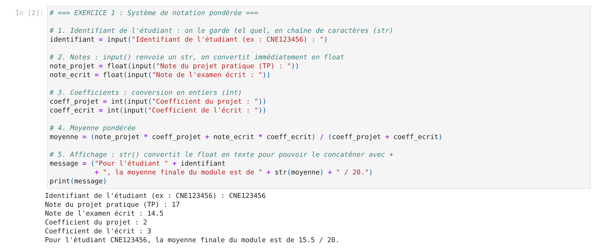
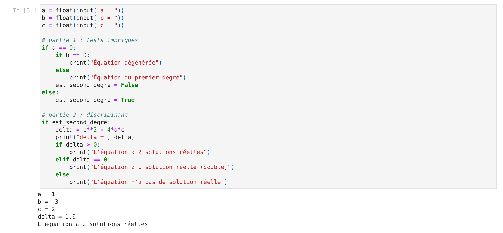
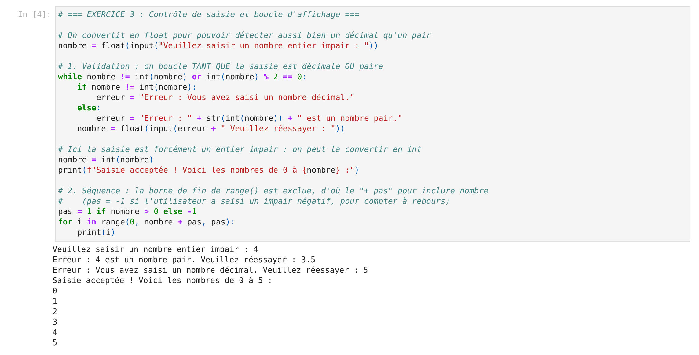
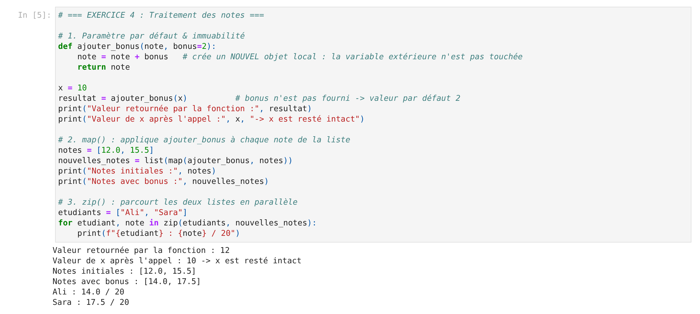
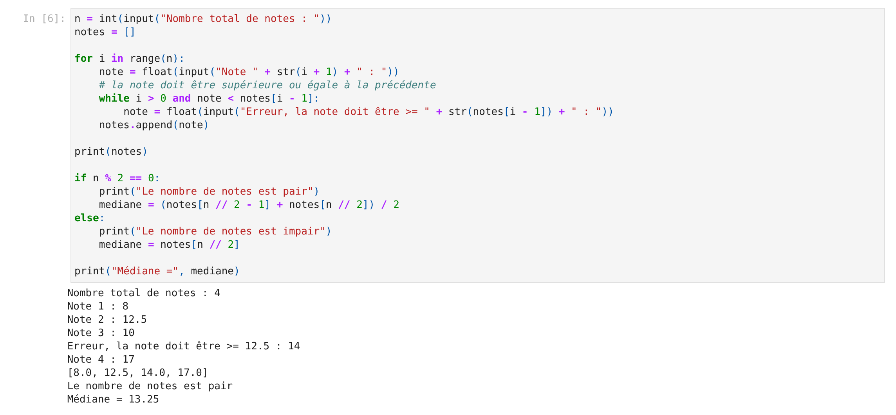
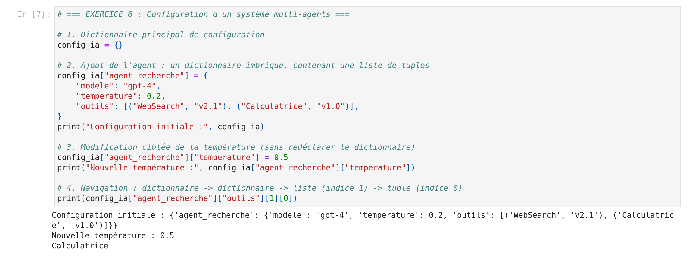

# TP1 Python — Partie 1

Solutions du TP1 de Python (partie 1) : conversions, structures conditionnelles, boucles, fonctions, listes, tuples et dictionnaires.

## Contenu

| Fichier | Description |
|---|---|
| `TP1python_partie1.ipynb` | Le notebook du TP avec les six exercices résolus et leurs sorties |
| `TP1_python_partie1_explications.pdf` | Le document de réponses : chaque solution expliquée pas à pas (raisonnement, exécutions, pièges) |
| `captures/` | Les captures du notebook exécuté, une par exercice |

## Exercices

1. **Système de notation pondérée** — `input()`, `float()`, `int()`, `str()`
2. **Analyse d'une équation du second degré** — tests imbriqués, booléen, discriminant
3. **Contrôle de saisie et boucle d'affichage** — `while`, `for`, `range()`
4. **Traitement des notes** — paramètre par défaut, immuabilité, `map()`, `zip()`
5. **Saisie ordonnée et médiane** — listes, indices, parité
6. **Configuration d'un système multi-agents** — dictionnaire, liste et tuples imbriqués

## Exécution

Ouvrir le notebook dans Jupyter ou VS Code, puis exécuter les cellules dans l'ordre :

```bash
pip install notebook
jupyter notebook TP1python_partie1.ipynb
```

Les exercices 1, 2, 3 et 5 demandent des saisies au clavier. Les sorties déjà enregistrées dans le notebook correspondent aux exemples détaillés dans le PDF.

## Captures d'écran

Chaque capture montre le code de l'exercice et le résultat de son exécution dans le notebook.

### Exercice 1 — Système de notation pondérée


### Exercice 2 — Analyse d'une équation du second degré


### Exercice 3 — Contrôle de saisie et boucle d'affichage


### Exercice 4 — Traitement des notes


### Exercice 5 — Saisie ordonnée et médiane


### Exercice 6 — Configuration d'un système multi-agents

